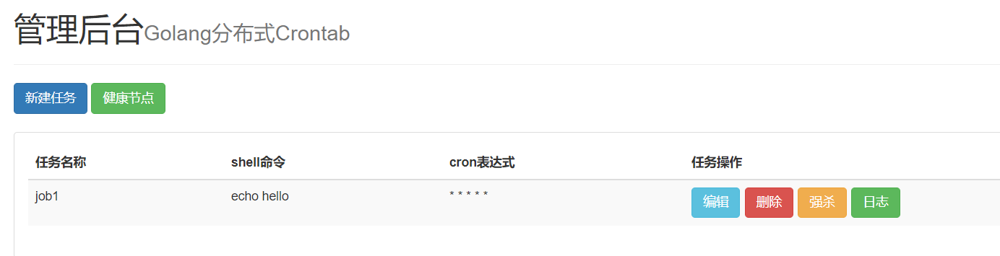
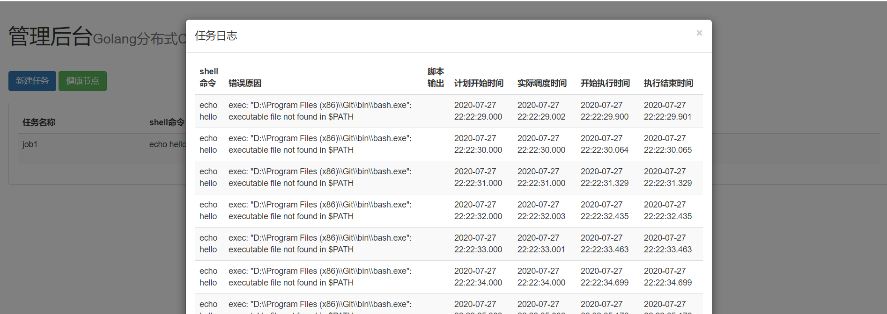

# go-crontab
Go开发的crontab 代替linux原生crontab

##简介
程序分为两个程序：
一个是master,负责后台管理维护计划任务。
一个是worker,负责调度和执行计划任务。
##安装

###下载
git clone XXX

###编译
#####分别进入到master目录和worker目录进行编译。
```cassandraql
//master
cd master/main
go build main.go

//worker
cd worker/main
go build main.go

//编译完成 生成可执行文件
```
###运行
###### 程序依赖Etcd,mongodb。请自行安装.并配置配置文件
###### 配置文件和main.go同一目录下
###### 直接运行可执行文件  可执行配置文件


```cassandraql
//运行命令
./main -config=./master.json
//配置文件和运行文件同级,可不指定
./main //即可

//注意 需要把master和worker都运行起来
```

###后台管理效果图
#### 效果图1

#### 效果图1

